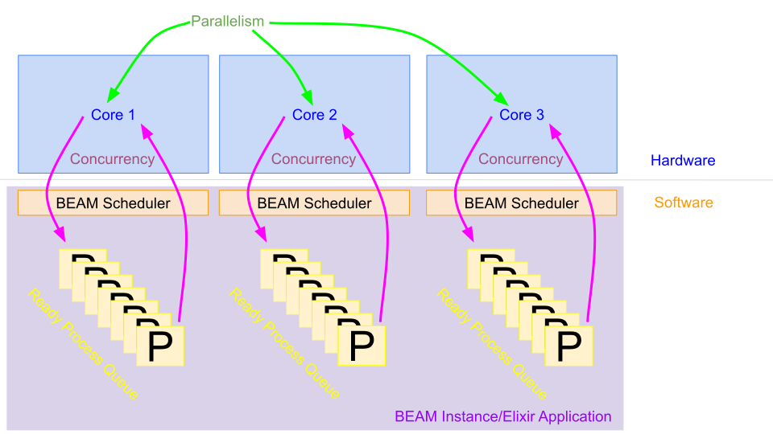

# Next Level Week 5 - Inmana

<p align="center">
  
</p>

## Table of Contents

- [About](#about)
- [Endpoints](#endpoints)
- [Setup](#setup)
- [Bash Commands](#bash_commands)
- [Elixir Commands](#elixir_commands)
- [Concepts](#concepts)
- [Libs](#libs)
- [Docs](#docs)
- [Resources](#resources)

## About <a name = "about"></a>

An inventory management backend made with Elixir and Phoenix.

## Endpoints <a name = "endpoints"></a>

Built-in

- `GET` http://localhost:4000/dashboard/home
- `GET` http://localhost:4000/sent_emails

`WelcomeController`

- `GET` http://localhost:4000/api?name=john&age=21

`RestaurantsController`

- `POST` http://localhost:4000/api/restaurants

`SuppliesController`

- `GET` http://localhost:4000/api/supplies/:uuid
- `POST` http://localhost:4000/api/supplies

## Setup <a name = "setup"></a>

1. Install `asdf`, an extensible version manager for node, clojure, elixir
   and ruby:

```bash
# Install apt-get packages
$ sudo apt install curl git

# Clone asdf
$ git clone https://github.com/asdf-vm/asdf.git ~/.asdf --branch v0.8.0

# Add it to your path
$ echo '# asdf version manager' >> ~/.bashrc
$ echo '. $HOME/.asdf/asdf.sh' >> ~/.bashrc
$ echo '. $HOME/.asdf/completions/asdf.bash' >> ~/.bashrc
```

- SOURCE: https://asdf-vm.com/#/core-manage-asdf

2. Install `Erlang`, `Elixir` and `Phoenix`:

```bash
# Install apt-get packages
$ sudo apt-get -y install build-essential autoconf m4 libncurses5-dev \
  libwxgtk3.0-gtk3-dev libgl1-mesa-dev libglu1-mesa-dev libpng-dev libssh-dev \
  unixodbc-dev xsltproc fop libxml2-utils libncurses-dev openjdk-11-jdk

# Add plugins
$ asdf plugin-add erlang
$ asdf plugin-add elixir

# Install and set Elixir
$ asdf install elixir 1.11.3
$ asdf global elixir 1.11.3

# Install and set Erlang
$ asdf install erlang 23.2
$ asdf global erlang 23.2

# Verify installation
$ erl --version
$ elixir --version

# Install Phoenix
$ mix archive.install hex phx_new 1.5.8
```

### Postgres

Create a postgress docker container with:

```bash
$ docker run --name postgres -e POSTGRES_PASSWORD=postgres -p 5432:5432 -d postgres
```

## Bash Commands <a name = "bash_commands"></a>

### Phoenix

```bash
# Create phoenix app without webpacker or html views
$ mix phx.new app_name --no-webpack --no-html

# Start Phoenix dev server on http://localhost:4000
$ mix phx.server

# List all configured routes
$ mix phx.routes

# Automagically generate schema and migration
$ mix phx.gen.schema Blog.Post blog_posts title:string views:integer
```

### Mix

```bash
# Install all dependencies
$ mix deps.get

# Compile project
$ mix compile

# Start your project as an Interactive Elixir session
$ iex -S mix

# Start your dev server with an Interactive Elixir session
$ iex -S mix phx.server

# Format all files
$ mix format

# Run a mix alias defined in ./mix.exs
$ mix example

# Run a mix task defined in ./lib/mix/tasks/example_task.ex
$ mix example_task
```

### Ecto

```bash
# Create and migrate database
$ mix ecto.setup

# Create a migration
$ mix ecto.gen.migration migration_name

# Run pending migrations
$ mix ecto.migrate

# Drop and migrate databases
$ mix ecto.reset

# Drop databases
$ mix ecto.drop

# Create databases
$ mix ecto.create
```

### Tests

```bash
# Run tests
$ mix test

# Run tests w/ coverage report
$ mix test --cover
```

### Credo

```bash
# Generate linter config file
$ mix credo.gen.config

# Run linter
$ mix credo
$ mix credo --strict
```

## Elixir Commands <a name = "elixir_commands"></a>

Create a restaurant:

```elixir
params = %{"name" => "Joe's coffee and dinner", "email" => "cup@joes.yum"}
params |> Inmana.Restaurants.Create.call()
```

Send expiration email:

```elixir
Inmana.Supplies.ExprationNotification.send()
```

`Task` module:

```elixir
list = [%{a: 5, b: 2}, %{a: 12, b: 2}, %{a: 86, b: 2}]
Task.async_stream(list, fn element -> IO.puts(element.a) end) |> Stream.run()
```

Atoms vs Words

```elixir
:timer.tc(fn ->
  :word == :word
  :word != :word

  :dasdasdadasdsadasdasdasdasdqwedqsczxcaseei0i0eijqwjcxjicjz ==
    :dasdasdadasdsadasdasdasdasdqwedqsczxcaseei0i0eijqwjcxjicjz

  :dasdasdadasdsadasdasdasdasdqwedqsczxcaseei0i0eijqwjcxjicjz !=
    :dasdasdadasdsadasdasdasdasdqwedqsczxcaseei0i0eijqwjcxjicjz
end)

:timer.tc(fn ->
  "word" == "word"
  "word" != "word"

  "dasdasdadasdsadasdasdasdasdqwedqsczxcaseei0i0eijqwjcxjicjz" ==
    "dasdasdadasdsadasdasdasdasdqwedqsczxcaseei0i0eijqwjcxjicjz"

  "dasdasdadasdsadasdasdasdasdqwedqsczxcaseei0i0eijqwjcxjicjz" !=
    "dasdasdadasdsadasdasdasdasdqwedqsczxcaseei0i0eijqwjcxjicjz"
end)
```

## Concepts <a name = "concepts"></a>

### Concurrency vs. Parallelism

<p>
  
</p>

## Libs <a name = "libs"></a>

- https://github.com/phoenixframework/phoenix
- https://github.com/rrrene/credo
- https://github.com/thoughtbot/bamboo

## Docs <a name = "docs"></a>

- https://elixir-lang.org/crash-course.html
- https://hexdocs.pm/ecto/Ecto.Changeset.html#traverse_errors/2
- https://hexdocs.pm/elixir/master/Task.html#async_stream/3
- https://hexdocs.pm/elixir/master/GenServer.html
- https://github.com/elixir-lang/elixir/releases
- https://elixirschool.com/en/lessons/basics/mix-tasks
- https://hexdocs.pm/phoenix/Mix.Tasks.Phx.Gen.Schema.html

## Resources <a name = "resources"></a>

- https://www.electronjs.org/apps/postbird
- https://www.beekeeperstudio.io/get
